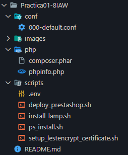
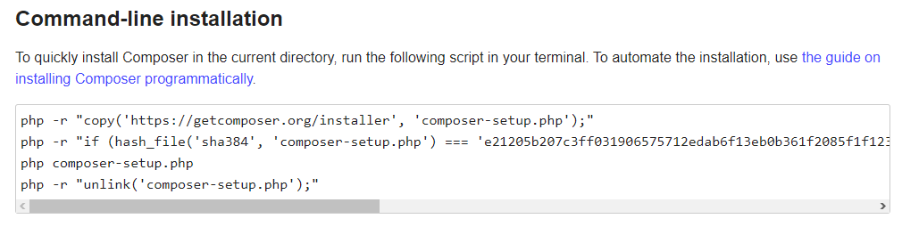
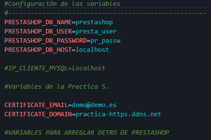
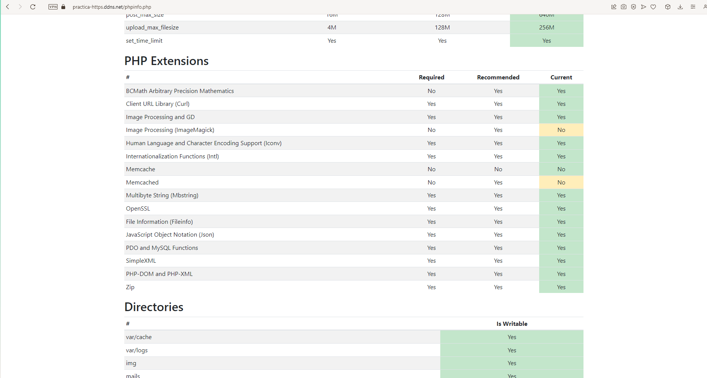
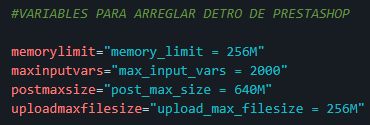
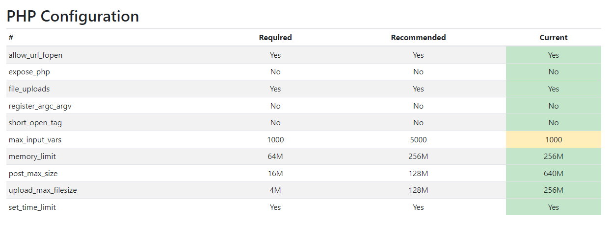
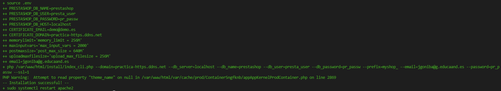
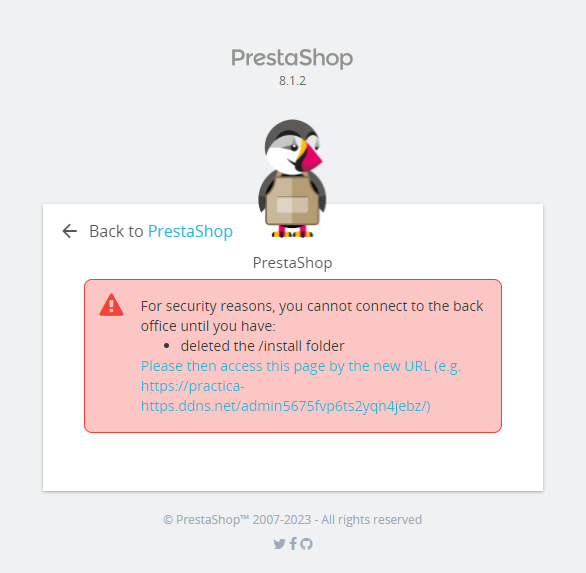
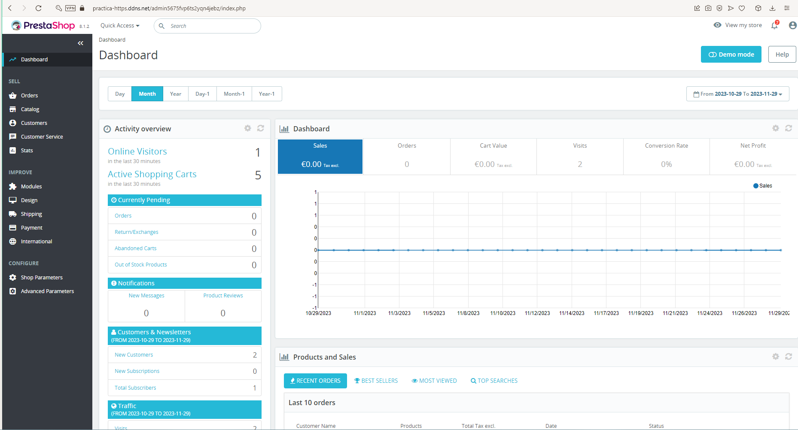

# Practica01-8IAW
Este repositorio es para la Práctica 1 apartado 8 de IAW.


## ¿En que consiste esta práctica?

- En esta práctica tenemos que implementar la aplicación web *_PrestaShop_* en una máquina de Amazon Web Service.

    La estructura de esta práctica sera la siguiente:

    1. Un script *_install_lamp_* 
    2. Un script *_deploy_prestashop_*
    3. Un script para instalar el *_cli_* de PrestaShop llamado *_ps_install_*
    4. El script con la configuración del cerbot, llamado *_setup_lestencrypt_certificate_*

    Algunos de los scripts que hemos mencionado anteriormente los hemos utilizado en prácticas anteriores. Pero los que estan relacionados con PrestaShop, son nuevos, por lo tanto vamos a explicar como funcionan y las configuraciones que tienen.

    Es muy importante tener en cuenta que en esta práctica tendremos que tener nuestro archivo *-.env._* al igual que una serie de carpetas con configuraciones que hemos tenido anteriormente:

    1. conf --> *_000-default.conf_*

    2. php --> *_phpinfo.php_* y *_composer.phar_* que explicaremos junto con el script que funcionalidad tiene el llamado *_composer.phar_*.


### Imágen de la organización de la práctica.


- La organización deberá ser así:

    


# Script *_install_lamp_*

- El primer script que tenemos que ejecutar es el que ya conocemos que contiene la información, instalación y configuración de por ejemplo_
    1. `Apache`
    2. El archivo `000-default.conf`
    3. Instalación de `MySql`
    4. Y por último, `PHP`


    ```
    #!/bin/bash

    #Esto muestra todos los comandos que se van ejecutando
    set -x 
    #Actualizamos los repositorios
    apt update

    #Actualizamos los paquetes de la máquina 

    #apt upgrade -y

    # Instalamos el servidor web apache A.

    apt install apache2 -y

    #Copiamos el directorio 000-default.conf

    cp ../conf/000-default.conf /etc/apache2/sites-available/000-default.conf

    # Instalamos Mysql L.

    sudo apt install mysql-server -y

    # Instalamos PHP.

    sudo apt install php libapache2-mod-php php-mysql -y

    # Reiniciamos el servicio (apache)

    systemctl restart  apache2


    #Movemos el código de PHP.info al directorio /var/Www/html/Prestashop.8.0.0

    cp /home/ubuntu/Practica01-8IAW/php/phpinfo.php /var/www/html

    # Modificamos el propietario y el grupo del directorio /var/www/html

    chown -R www-data:www-data /var/www/html

    ```


- Como podemos observar instalamos las diferentes depencias de la pila *_LAMP_*, algunas con sus respectivas librerias que nos permiten su correcta ejecución con esta práctica.

- La primera linea importante que podemos observar que hacemos un `cp` con el archivo *_phpinfo.php_* al directorio `/var/www/html` , esto lo hacemos para copiar la información que tenemos al directorio de apache.

    De manera que cuando hagamos el *_deploy_* más adelante lo tengamos en el mismo directorio para que podamos hacer uso de ese archivo en la URL del sitio.

    Todo las demás aplicaciones de la pila *_LAMP_* realizan la misma función que anteriormente hemos instalado. Así mismo, podemos observar nuestro archivo *_000-default.conf_* como lo movemos al directorio `/etc`


# Script para el *_Deploy_PrestaShop_*

- Este es el script que tenemos que crear desde cero en esta práctica, por lo tanto iremos explicando las lineas mas importantes.

```
    #!/bin/bash
    # Script para instalar prestashop en su propio directorio. 
    #Esto muestra todos los comandos que se van ejecutando
    set -ex 
    #Actualizamos los repositorios
    apt update

    #Actualizamos los paquetes de la máquina 

    #apt upgrade -y

    #Incluimos las variables del archivo .env

    source .env

    # Instalamos Unzip para descomprimir el archivo de prestashop.zip

    sudo apt install unzip -y


    #Borramos los archivos por si tenemos que volver a lanzar el script.

    rm -rf /tmp/prestashop_8.1.2.zip

    #Descargamos la última versión de PrestaShop con el comando wget.


    wget https://github.com/PrestaShop/PrestaShop/releases/download/8.1.2/prestashop_8.1.2.zip -P /tmp


    #Eliminamos el directorio para posteriores instalaciones.


    rm -rf /var/www/html/*

    #Descomprimimos el archivo.


    unzip /tmp/prestashop_8.1.2.zip -d /var/www/html/

    #Recordar hacer el unzip de prestashop manualmente en /var/www/html
    #sudo unzip /var/www/html/prestashop.zip


    #Ejecutamos el comando para dar permisos al usuario de apache.

    sudo chown www-data:www-data /var/www/html/* -R

    #Creamos la base de datos

    mysql -u root <<< "DROP DATABASE IF EXISTS $PRESTASHOP_DB_NAME"
    mysql -u root <<< "CREATE DATABASE $PRESTASHOP_DB_NAME"
    mysql -u root <<< "DROP USER IF EXISTS $PRESTASHOP_DB_USER@$IP_CLIENTE_MYSQL"
    mysql -u root <<< "CREATE USER $PRESTASHOP_DB_USER@$IP_CLIENTE_MYSQL IDENTIFIED BY '$PRESTASHOP_DB_PASSWORD'"
    mysql -u root <<< "GRANT ALL PRIVILEGES ON $PRESTASHOP_DB_NAME.* TO $PRESTASHOP_DB_USER@$IP_CLIENTE_MYSQL"

    #Reiniciamos apache

    sudo systemctl restart apache2

    #----------------- INSTALAMOS LOS PAQUETES RECOMENDADOS -----------------------------#

    #1.PAQUETE

    apt install php-bcmath -y

    #2. PAQUETE

    apt install php-intl -y

    #3. PAQUETE

    apt install memcached -y

    apt install libmemcached-tools -y

    #4. PAQUETE

    apt install php-curl -y
    #5. PAQUETE

    apt install php-gd -y

    #6. PAQUETE

    apt install php-mbstring -y

    #7. PAQUETE

    apt-get install php-dom php-xml -y

    #8. PAQUETE

    apt install php-zip -y


    #Reiniciamos de nuevo apache

    sudo systemctl restart apache2

    #-----------------------------------------------------------------------------------------------------

    #Modificamos los parametros de sed dentro de prestashop y php.

    sed -i "s/memory_limit = 128M/$memorylimit/" /etc/php/8.1/apache2/php.ini
    sed -i "s/max_input_vars = 1000/$maxinputvars/" /etc/php/8.1/apache2/php.ini
    sed -i "s/post_max_size = 8M/$postmaxsize/" /etc/php/8.1/apache2/php.ini
    sed -i "s/upload_max_filesize = 2M/$uploadmaxfilesize/" /etc/php/8.1/apache2/php.ini


    #Reiniciamos de nuevo apache
    sudo systemctl restart apache2

```


- Como primer paso tendremos que descargar el código fuente del repositorio de GitHub que tenemos puesto en el Script a través de esa URL y con ayuda de la sentencia `-P` indicamos donde queremos almancenar ese archivo. Lo almacenamos dentro del directorio `/tmp` para más adelante poder descomprimirlo y moverlo al directorio que queremos.

    En el caso de que no tengamos la herramienta `wget` descargada podemos usar `tar`, pero si queremos usarlo lo instalamos con `sudo apt install unzip -y` y `sudo apt install wget`


- Cuando ya lo tengamos descargado, lo decomprimimos, eso si, borrando siempre instalaciones previas de los directorios para que cuando lancemos el script en repetidas ocasiones no este todo el rato creando el mismo archivo.

    Al fin de cuentas, queremos moverlo al directorio de apache2 `var/www/html` por lo tanto haremos un `rm -rf` de los archivos con el nombre del mismo que estamos descomprimiendo para asegurarnos que no se repiten los archivos. 

    Una vez dentro podemos descomprimirlo de manera manual o lo ejecutamos junto con el script. Lo hacemos como indica el script `unzip [Directorio]+[Nombre_del_archivo]` en este caso: `unzip /tmp/prestashop_8.1.2.zip -d /var/www/html/`

    Ejecutamos el `chown` autorizar los permisos al usuario de apache `www.data` y ya tendriamos la configuración. 

### Composer.phar

- Este apartado va relacionado para futuros problemas, es decir, este archivo tendremos que descargarlo através de una serie de comandos que nos encontramos en la siguiente página web: [Donwload Composer](https://getcomposer.org/download/), este archivo esta creado para la instalación de la versión 8.0.0, pero nosotros estamos instalando la versión 8.1.2 por lo tanto no lo necesitamos.

    En mi caso lo instalé anteriormente en la máquina por que prové a instalar la versión 8.0.0. Los comandos que tenemos que seguir son los que encontramos en la siguiente imágen:

    


### Creación de la base de datos.

- Crearemos la base de datos como anteriormente hemos hecho en otras prácticas, pero tendremos que configurar el nombre de las variables para que las pongamos al gusto nuestro de *_PrestaShop_*

    Mi archivo *_.env.* en este caso será el siguiente:

    


    Junto con el correspondiente script que hemos puesto anteriormente pero podemos repetir aquí:

    ```
        mysql -u root <<< "DROP DATABASE IF EXISTS $PRESTASHOP_DB_NAME"
        mysql -u root <<< "CREATE DATABASE $PRESTASHOP_DB_NAME"
        mysql -u root <<< "DROP USER IF EXISTS $PRESTASHOP_DB_USER@$IP_CLIENTE_MYSQL"
        mysql -u root <<< "CREATE USER $PRESTASHOP_DB_USER@$IP_CLIENTE_MYSQL IDENTIFIED BY '$PRESTASHOP_DB_PASSWORD'"
        mysql -u root <<< "GRANT ALL PRIVILEGES ON $PRESTASHOP_DB_NAME.* TO $PRESTASHOP_DB_USER@$IP_CLIENTE_MYSQL"


    ```


## Instalamos los paquetes recomendados.

- Este apartado sale marcado en el script y ¿Por qué? Todo esto es debido a que cuando lancemos el script con la instalación y accedamos en la *_URL_* al archivo *_phpinfo.php_* (Deberia de sonarte por que antes hemos hablado de el :P ) Nos saldrán una serie de parámetros que tendremos que tener en color verde como nos piden en la práctica.

    Al acceder a la URL deberemos de ver la siguiente imagen:


    
    

    Las extensiones podemos encontrarlas buscando el nombre de cada una por internet o algunas incluso en la página oficial de [PHP](https://www.php.net).

    ``` 
    #----------------- INSTALAMOS LOS PAQUETES RECOMENDADOS -----------------------------#

        #1.PAQUETE

        apt install php-bcmath -y

        #2. PAQUETE

        apt install php-intl -y

        #3. PAQUETE

        apt install memcached -y

        apt install libmemcached-tools -y

        #4. PAQUETE

        apt install php-curl -y
        #5. PAQUETE

        apt install php-gd -y

        #6. PAQUETE

        apt install php-mbstring -y

        #7. PAQUETE

        apt-get install php-dom php-xml -y

        #8. PAQUETE

        apt install php-zip -y


        #Reiniciamos de nuevo apache

        sudo systemctl restart apache2
    ```

## Parámetros de RAM.

- Tendremos también que configurar una serie de parámetros que cuando accedemos al `phpinfo.php` de nuestra página nos saldrán en rojo, los mejoramos a la misma cantidad o incluso más del apartado *_Recomendado_*

     Lo modificamos haciendo uso del comando `sed -i` como hemos hecho anteriormente y también declarando una serie de variables dentro de nuestro `.env`

     ```
     #Modificamos los parametros de sed dentro de prestashop y php.

    sed -i "s/memory_limit = 128M/$memorylimit/" /etc/php/8.1/apache2/php.ini
    sed -i "s/max_input_vars = 1000/$maxinputvars/" /etc/php/8.1/apache2/php.ini
    sed -i "s/post_max_size = 8M/$postmaxsize/" /etc/php/8.1/apache2/php.ini
    sed -i "s/upload_max_filesize = 2M/$uploadmaxfilesize/" /etc/php/8.1/apache2/php.ini
     
     ```

     Las variables que hemos declaro en nuestro *_.env_* son las siguientes:

     

     Si lanzamos el script y lo configuramos todo de manera correcta nos encontraremos con la siguiente imagen en el apartado de configuración:


     

    

# Script para instalador mediante *_cli_* la aplicación *_PrestaShop_*

- Como último script que tendremos que crear sera para instalar *_prestashop_*. La estructura que tenemos que tener en el script es la siguiente:

    ```
    #!/bin/bash
    # Script para instalar prestashop en su propio directorio. 
    #Esto muestra todos los comandos que se van ejecutando
    set -ex 
    #Actualizamos los repositorios
    apt update

    #Actualizamos los paquetes de la máquina 

    #apt upgrade -y

    #Incluimos las variables del archivo .env

    source .env

    #--- INSTALACIÓN PRESTASHOP ----------------------------------------------

    php /var/www/html/install/index_cli.php \
        --domain=$CERTIFICATE_DOMAIN \
        --db_server=$PRESTASHOP_DB_HOST \
        --db_name=$PRESTASHOP_DB_NAME \
        --db_user=$PRESTASHOP_DB_USER \
        --db_password=$PRESTASHOP_DB_PASSWORD \
        --prefix=myshop_ \
        --email=$email \
        --password=$PRESTASHOP_DB_PASSWORD \
        --ssl=1


    #Reiniciamos de nuevo apache

    sudo systemctl restart apache2


    ```

- Como podemos observar indicamos el directorio donde se encuentra la carpeta *_install_* junto con su respectivo *_index_cli.php_* que permitiran que todas las variables que encontramos debajo se configuren de manera correcta. Alguna de ellas son las que hemos declarado anteriormente dentro de nuestro archivo *.env_*

- Lo ejecutamos y si todo esta correcto, encontraremos lo siguiente en la consola:

    

### Dato

- Podemos encontrar más extensiones que configurar en el script de manera automática como pueden ser el pais o idioma, podemos encontrar toda la documentación en la página siguiente : [Install PrestaShop CLI](https://devdocs.prestashop-project.org/8/basics/installation/advanced/install-from-cli/).

## Accedemos como admin.

- Para acceder como admin haremos uso de las variables que hemos configurado anteriormente, es decir `email` y `contraseña`

- Pero... no tan rápido crack, que para poder acceder tendremos que hacer un `rm -rf /var/www/html/install` por temas de seguridad.

    


    Cuando accedamos generará en nuestro `/var/www/html/`un directorio con el nombre de *_admin_* y un número, para que así sea seguro y nadie sepa acceder a través de la URL.

    Si ponemos ese nombre y número en la *_URL_* nos cargará el login y poniendo el correo y contraseña que hayamos puesto en nuestro *_.env_* nos permitirá acceder al dashboard de administrador :D.

     


### Apuntes varios.

- En está practica tambien encontramos una serie de directorios que deberan estar en verde si a la hora de hacer el `unzip y wget` están bien configurados.

